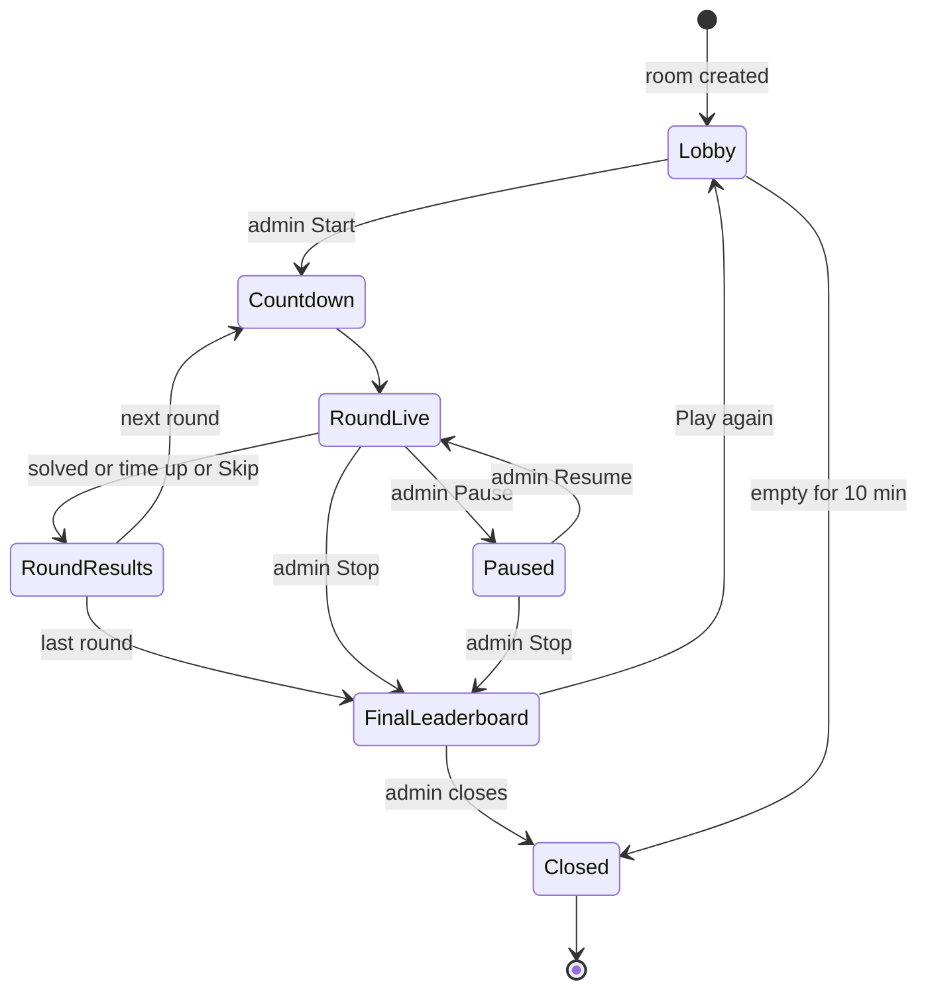

# Architecture

The full product plan (game modes, scoring, screens, test plan, failure cases)
is the TB-19 epic. This doc covers how the code is organised and the contracts
every task builds on. Update it when you change one of those contracts.

## Stack

| Part             | Choice                                                   |
| ---------------- | -------------------------------------------------------- |
| App              | Next.js (App Router), React, TypeScript (strict)         |
| Styling          | Tailwind CSS v4                                          |
| Editor           | Monaco                                                   |
| Database + live  | Supabase (Postgres + Realtime)                           |
| Code runner (v1) | In the browser: Web Worker for JS/TS, Pyodide for Python |
| Hosting          | Vercel (preview deploy per PR)                           |
| Tests            | Vitest (unit), Playwright (E2E)                          |
| Tooling          | pnpm, ESLint, Prettier, GitHub Actions                   |

## Folder map

```text
app/                  Routes (App Router). Pages stay thin: they compose components.
components/           Reusable UI components.
lib/runner/           Code-runner plug-in interface, language config, runners.
lib/game/             Pure game logic: scoring, room state machine, room codes.
lib/supabase/         (later) Supabase client + typed queries.
puzzles/              Puzzle files (format defined in Phase 2).
supabase/migrations/  SQL migrations (Phase 1.4).
scripts/              Repo scripts, e.g. the puzzle checker.
e2e/                  Playwright tests.
docs/                 This doc and other design notes.
```

Rules of thumb:

- `lib/game` is framework-free TypeScript (no React, no Supabase), so it is
  easy to unit test. UI and data access call into it, never the other way.
- Anything that talks to Supabase goes through `lib/supabase`; components do
  not build queries inline.
- Client components only where needed (editor, realtime, interaction).

## Code runner plug-in interface

Defined in `lib/runner/types.ts` (types) and `lib/runner/config.ts`
(language list, limits). Phase 2 adds the implementations.

```ts
type LanguageId = "javascript" | "typescript" | "python";

interface RunRequest {
  language: LanguageId;
  code: string; // player's code (or the reference fix)
  tests: string; // test source in the same language
  timeoutMs?: number; // default DEFAULT_RUN_TIMEOUT_MS = 5000
}

type RunStatus = "passed" | "failed" | "error" | "timeout";

interface RunResult {
  status: RunStatus;
  tests: { name: string; passed: boolean; message?: string }[];
  output: string; // console output, capped at MAX_OUTPUT_CHARS
  error?: string; // for "error" / "timeout"
  durationMs: number;
}

interface CodeRunner {
  readonly language: LanguageId;
  run(request: RunRequest): Promise<RunResult>; // never rejects
  dispose(): void;
}
```

Contract for implementations:

- Code runs off the main thread (Web Worker). The page must never freeze.
- The timeout is enforced from the outside: terminate the worker after
  `timeoutMs` and return `status: "timeout"`. Do not trust code to stop itself.
- No network, DOM or storage access from user code.
- Syntax errors and crashes return `status: "error"`; `run` never throws.
- Adding a language = add a `LanguageId`, a `LANGUAGES` entry, a runner, and
  puzzles. Nothing else should change.

Known trade-off (accepted): runs happen in the player's browser, so a
determined player could fake a pass with dev tools. Fine for an internal game.

## Room state machine

Copied from TB-19 §12. The room's current state lives in the database and is
broadcast over Supabase Realtime. Only the admin moves the room between states
(except time-based transitions).



The state ids in code (`RoomState` in `lib/game/types.ts`) are `lobby`,
`countdown`, `round_live`, `paused`, `round_results`, `final_leaderboard`,
`closed`. Every transition above gets a unit test when the machine is
implemented; any transition not listed is rejected.

## Data model outline

Draft for Phase 1.4 (database schema), which owns the final columns,
constraints, indexes and row-level security.

| Table     | Purpose                     | Key fields (draft)                                                                                                                                                                                  |
| --------- | --------------------------- | --------------------------------------------------------------------------------------------------------------------------------------------------------------------------------------------------- |
| `rooms`   | One race room               | `id`, `code` (6 chars, no 0/O/1/I, unique among open rooms), `admin_player_id`, `state`, `language`, `level`, `rounds` (null = until stopped), `current_round`, `locked`, `created_at`, `closed_at` |
| `players` | A person in a room          | `id`, `room_id`, `name` (unique per room, "Riya (2)"), `avatar` (emoji), `is_connected`, `joined_at`                                                                                                |
| `puzzles` | Buggy snippet + tests       | `id`, `language`, `level`, `title`, `buggy_code`, `tests`, `reference_fix`, `hints`. Source of truth is `puzzles/`; the table is seeded from it.                                                    |
| `rounds`  | One puzzle played in a room | `id`, `room_id`, `number`, `puzzle_id`, `started_at`, `ends_at`, `paused_at`                                                                                                                        |
| `scores`  | A player's result per round | `id`, `round_id`, `player_id`, `solved`, `solved_at` (server time, breaks ties), `hints_used`, `points`                                                                                             |

Scoring (TB-19 §3): score = base points (Easy 100 / Medium 200 / Hard 300) +
speed bonus − hint penalty. Unsolved = 0. Ties are decided by server
timestamp; exact ties share the place.

## Environment

Only public values (`NEXT_PUBLIC_SUPABASE_URL`, `NEXT_PUBLIC_SUPABASE_ANON_KEY`)
are used by the app; see `.env.example`. Data is protected by Supabase
row-level security, not by hiding the anon key. Service-role keys never go in
this repo or in client code.
