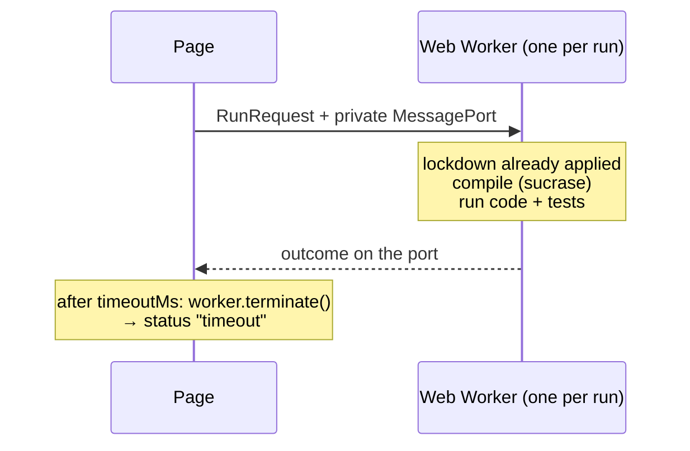
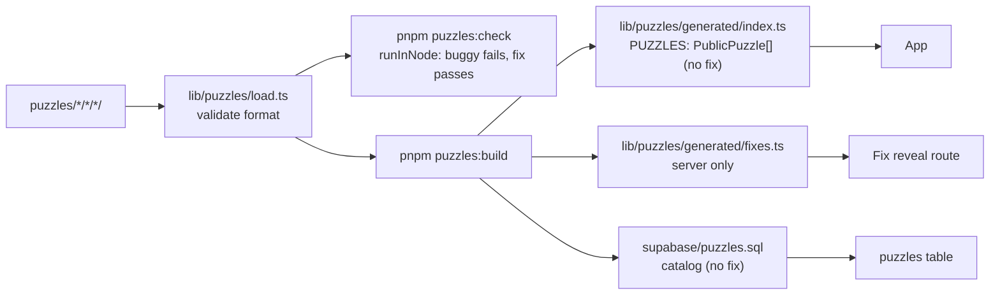
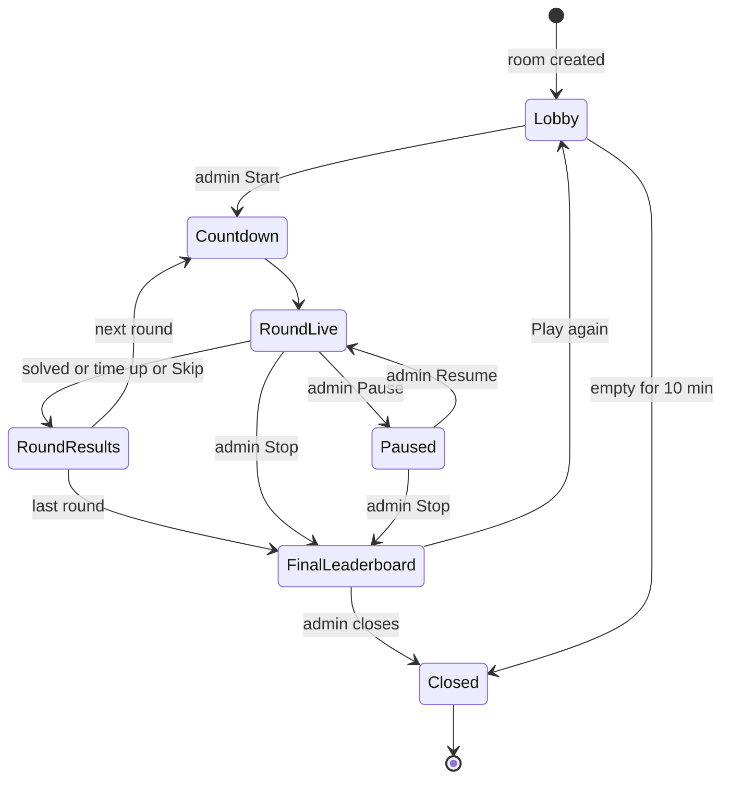
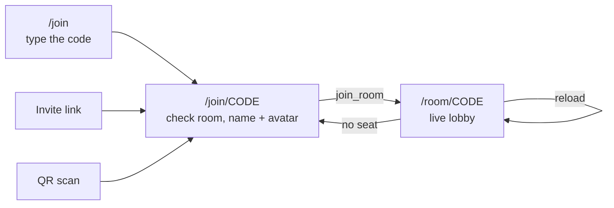
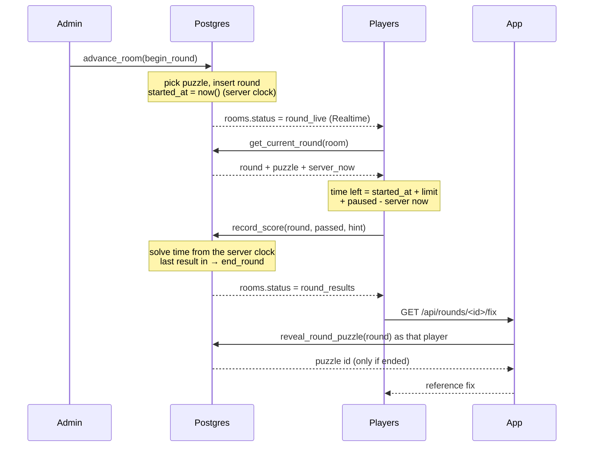
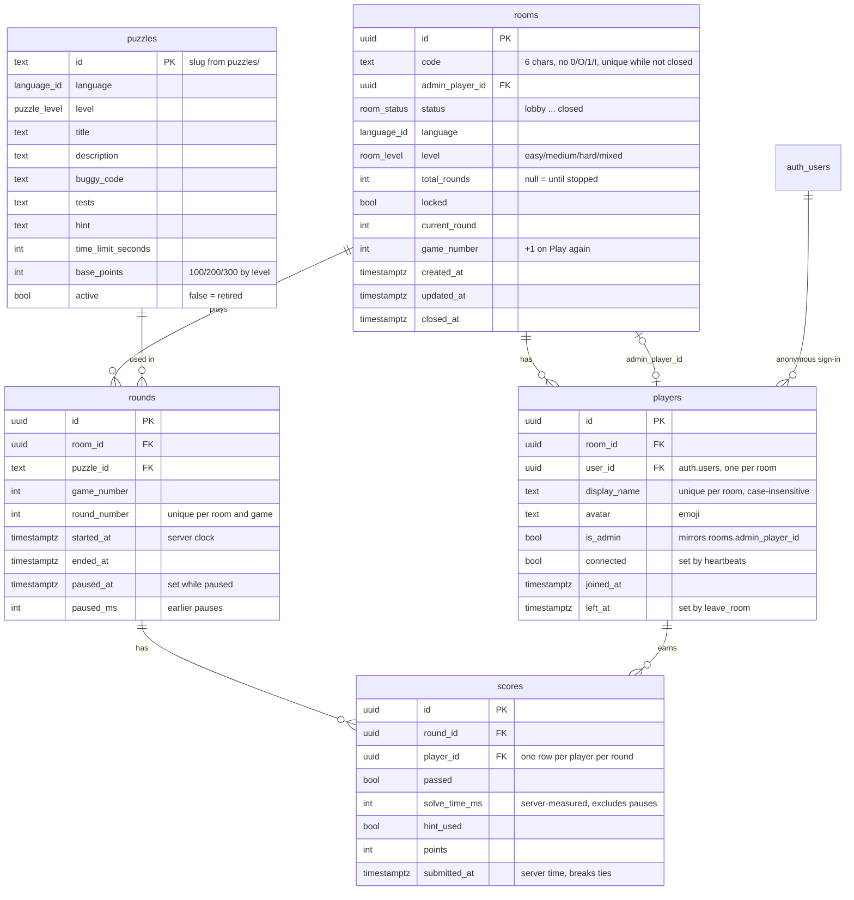

# Architecture

The full product plan (game modes, scoring, screens, test plan, failure cases)
is the TB-19 epic. This doc covers how the code is organised and the contracts
every task builds on. Update it when you change one of those contracts.

## Stack

| Part             | Choice                                                   |
| ---------------- | -------------------------------------------------------- |
| App              | Next.js (App Router), React, TypeScript (strict)         |
| Styling          | Tailwind CSS v4                                          |
| Editor           | Monaco                                                   |
| Database + live  | Supabase (Postgres + Realtime)                           |
| Code runner (v1) | In the browser: Web Worker for JS/TS, Pyodide for Python |
| Hosting          | Vercel (preview deploy per PR)                           |
| Tests            | Vitest (unit), Playwright (E2E)                          |
| Tooling          | pnpm, ESLint, Prettier, GitHub Actions                   |

## Folder map

```text
app/                  Routes (App Router). Pages stay thin: they compose components.
components/           Reusable UI components.
lib/runner/           Code-runner plug-in interface, language config, runners.
lib/game/             Pure game logic: scoring, room state machine, room codes.
lib/db/               Supabase client, generated types, typed data access.
lib/rooms/            Live room connection: Realtime, presence, heartbeats.
lib/puzzles/          Puzzle format, loader, checker, generated puzzle index.
puzzles/              Puzzle files: <language>/<level>/<id>/ (see puzzles/README.md).
supabase/             Local Supabase config, SQL migrations, puzzle catalog seed, pgTAP tests.
scripts/              Repo scripts, e.g. the puzzle checker.
e2e/                  Playwright tests; multi-player harness in e2e/support/.
docs/                 This doc and other design notes.
```

Rules of thumb:

- `lib/game` is framework-free TypeScript (no React, no Supabase), so it is
  easy to unit test. UI and data access call into it, never the other way.
- Anything that talks to Supabase goes through `lib/db`; components do not
  build queries inline.
- Client components only where needed (editor, realtime, interaction).

## Code runner plug-in interface

Defined in `lib/runner/types.ts` (types) and `lib/runner/config.ts`
(language list, limits). Phase 2 adds the implementations.

```ts
type LanguageId = "javascript" | "typescript" | "python";

interface RunRequest {
  language: LanguageId;
  code: string; // player's code (or the reference fix)
  tests: string; // test source in the same language
  timeoutMs?: number; // default DEFAULT_RUN_TIMEOUT_MS = 5000
}

type RunStatus = "passed" | "failed" | "error" | "timeout";

interface RunResult {
  status: RunStatus;
  tests: { name: string; passed: boolean; message?: string }[];
  output: string; // console output, capped at MAX_OUTPUT_CHARS
  error?: string; // for "error" / "timeout"
  durationMs: number;
}

interface CodeRunner {
  readonly language: LanguageId;
  run(request: RunRequest): Promise<RunResult>; // never rejects
  dispose(): void;
}
```

Contract for implementations:

- Code runs off the main thread (Web Worker). The page must never freeze.
- The timeout is enforced from the outside: terminate the worker after
  `timeoutMs` and return `status: "timeout"`. Do not trust code to stop itself.
- No network, DOM or storage access from user code.
- Syntax errors and crashes return `status: "error"`; `run` never throws.
- Adding a language = add a `LanguageId`, a `LANGUAGES` entry, a runner, and
  puzzles. Nothing else should change.

Known trade-off (accepted): runs happen in the player's browser, so a
determined player could fake a pass with dev tools. Fine for an internal game.

### Using a runner

```ts
import { getRunner } from "@/lib/runner/registry"; // browser only

const result = await getRunner("typescript").run({
  language: "typescript",
  code: playerCode,
  tests: puzzle.tests,
});
```

`getRunner(language)` returns a shared runner per language and throws for a
language without one. Every `run` gets a **fresh
worker**, so nothing leaks between runs; `dispose()` stops runs in flight.

CI and other Node code use `runInNode(request)` from `@/lib/runner/node`. It
uses the same compiler, harness and lockdown, in a `worker_threads` thread that
is terminated on timeout, so a puzzle passes in CI exactly when it passes in
the browser. An E2E test runs the shared cases in `lib/runner/test-cases.ts`
in both and requires identical results.

### JS/TS runner (`lib/runner/js/`)



- **Compile:** [sucrase](https://github.com/alangpierce/sucrase) strips
  TypeScript types (no type checking, so type errors never block a run) and
  parses JavaScript, so syntax errors read like
  `SyntaxError in your code: Unexpected token (2:13)`. It adds about 48 KB
  gzipped to the worker chunk only; the `typescript` package would be ~3 MB.
  Modern syntax is kept as is. Puzzle code is a plain script: no
  `import`/`export`.
- **Scope:** the code and the tests run as one async function body, code
  first, so tests can call anything the code declares and may use top-level
  `await`. A name declared in both is a `SyntaxError`.
- **Result back:** sent on a `MessagePort` that only the harness holds, so
  player code cannot post a fake result to the page.

### Test harness API (JS/TS)

```js
test("adds two numbers", () => {
  expect(add(2, 3)).toBe(5); // Object.is
  expect(parse("1,2")).toEqual([1, 2]); // deep: arrays, objects, Map, Set, Date, RegExp
  expect(() => parse("")).toThrow(); // optional: toThrow("text") or toThrow(/regex/)
});
test("async works too", async () => {
  expect(await load()).toEqual({ ok: true });
});
```

- Tests run in order, one at a time. A failed `expect` or a throw fails that
  test only, with a message such as `Expected 5, received -1`.
- `status`: `passed` if every test passed; `failed` if any failed; `error` on
  a syntax error, a throw at the top level, a crash, or **no tests**.
- Unhandled promise rejections are ignored: a test fails only through what it
  awaits. An error thrown outside awaited code (e.g. in a `setTimeout`
  callback) ends the run as `error`, e.g. `Error: late`.
- `self` is the global scope in both environments; `close()` and Node-only
  globals (`process`, `require`, `global`, `Buffer`, `setImmediate`) are
  blocked in both, so the browser and Node give the same result.
- `console.log/info/warn/error/debug` are captured into `output`, capped at
  `MAX_OUTPUT_CHARS` (10 000) with a `… output truncated` note. Output is lost
  on timeout (the worker is killed).

### Sandbox limits

- **CPU:** the worker is terminated after `timeoutMs` (default 5 s), whatever
  it is doing. The page stays responsive (E2E proves it).
- **Blocked globals** (`lib/runner/js/lockdown.ts`): `fetch`, `XMLHttpRequest`,
  `WebSocket`, `EventSource`, `WebTransport`, `importScripts`, `indexedDB`,
  `caches`, `navigator`, `postMessage`, nested `Worker`s, `BroadcastChannel`,
  `Notification`, `close`, and the Node-only globals listed above. Each is replaced by a
  non-configurable stub that throws `<name> is blocked in the sandbox`, and
  the original is deleted from the prototype chain.
- **Everything else on the network, including dynamic `import()`:** the
  worker script is served with
  `Content-Security-Policy: default-src 'none'; script-src 'self' 'unsafe-eval'`
  (`next.config.ts`). The browser blocks every connection and every
  cross-origin script. Same-origin scripts stay loadable, because Turbopack
  loads the worker's own chunks that way.
- **DOM, `localStorage`, cookies:** not present in workers.
- **Memory:** there is no browser-side cap (no API for one). Most runaway
  loops hit the 5 s timeout first, but allocating fast enough (e.g.
  `while (true) a.push(new Array(1e6).fill(1))`) can crash the **whole tab**,
  not just the worker. Node threads are capped at 256 MB.
- **Node entry is for trusted code only.** The thread gets the same lockdown,
  but Node cannot apply the worker CSP, so dynamic `import()` (`node:fs`,
  `data:` URLs) still works there. It runs puzzle files from this repo in CI,
  which are reviewed like any other code; never point it at player code.

The rule matches the worker bootstrap (`turbopack-worker-*.js`) under both
`/_next/static/chunks/` and `/_next/static/immutable/chunks/`. Vercel serves
content-hashed chunks from the `immutable/` path (`supportsImmutableAssets`);
`next.config.ts` turns that on too, so local and CI builds use the same paths
as production. If Turbopack renames its worker bootstrap or moves its chunks,
the CSP header stops matching; `next.config.test.ts` and the E2E tests `the
runner worker script is served with the worker CSP` and `network APIs are
blocked, including cross-origin import()` fail when that happens. Without this
CSP, Pyodide also refuses to start ("Classic web workers are not supported").

### Python runner (`lib/runner/python/`)

Python runs in the browser with [Pyodide](https://pyodide.org) (CPython
compiled to WebAssembly) in a Web Worker, behind the same `CodeRunner`
interface and the same `SandboxRunner` timeout logic as JS/TS.

- **Self-hosted, pinned.** `pyodide` is an exact-version npm dependency
  (`314.0.7`); `scripts/copy-pyodide.mjs` (run by `postinstall`) copies the
  runtime (about 13 MB) to `public/pyodide/<version>/` (git-ignored). Why not
  the CDN: no third-party host to trust or to be down during a game, the same
  version in the browser and in Node, and same-origin files let the worker's
  CSP stay at `'self'`. The versioned path is served `immutable`, so the
  browser downloads it once.
- **Warm spare** (`browser-pool.ts`). Booting Pyodide takes seconds, so the
  pool keeps one booted worker in reserve. A run takes the spare and a new
  one starts booting at once, which keeps "a fresh worker per run" and means
  the next run after a timeout (which killed its worker) is instant. A spare
  costs one idle Pyodide (a few tens of MB). Boot time is not part of the 5 s
  run clock: `OpenSession` may be async and the timer starts after it opens.
- **Preload.** `preloadRunner("python")` starts the download and boot; call it
  from the lobby or setup screen. `getPreloadState(lang)` /
  `subscribePreload(lang, cb)` (or the `usePreloadState(lang)` hook) give
  `{ status: "idle" | "loading" | "ready" | "error", progress: 0..1, error? }`.
  Progress is real download progress (bytes against `manifest.json`), then
  Pyodide init. JS and TS are always `ready`.
- **Node entry.** `runInNode({ language: "python", ... })` boots Pyodide from
  `node_modules` in a `worker_threads` thread, with the same harness and
  lockdown, and terminates it on timeout. It boots a fresh interpreter per
  call (about 1 s), which is fine for the puzzle checker. Trusted code only,
  like the JS entry.

### Test harness API (Python)

Puzzle tests are plain functions using `assert`:

```python
def test_adds_two_numbers():
    assert add(2, 3) == 5
```

- The code and the tests run in one namespace, code first. Every function
  named `test_*` defined by the tests runs in definition order; a failed
  assert or any exception fails that test only.
- A bare `assert a == b` (also `!=`, `<`, `in`, `is`, ...) is rewritten to
  explain itself: `assert add(2, 3) == 5 (left: -1, right: 5)`. Other bare
  asserts report their source (`assert is_valid(x)`). A custom message
  (`assert x, "why"`) is used as written. Other exceptions read
  `IndexError: list index out of range`.
- `status`: `passed`, `failed`, or `error` for a syntax error
  (`SyntaxError in your code: expected ':' (line 1)`), an exception at the top
  level, or **no tests**. `async def` tests are not supported (reported as a
  failed test).
- `print` and `sys.stderr` output is captured into `output`, capped at
  `MAX_OUTPUT_CHARS` like JS. Output is lost on timeout.

### Python sandbox limits

- **CPU:** the worker is terminated after `timeoutMs`, whatever Python is
  doing (`while True: pass`). Same for Node.
- **Network:** CPython in WebAssembly has no sockets, so `socket` and
  `urllib` fail with `OSError`. Everything that goes through the browser
  (`js.fetch`, `XMLHttpRequest`, `WebSocket`, `pyodide.http.pyfetch` and
  `open_url`) hits the same lockdown stubs as the JS runner and
  throws `<name> is blocked in the sandbox`. The lockdown is applied after
  Pyodide has loaded, so the runtime itself still works.
- **CSP:** the worker's CSP is `default-src 'none'; script-src 'self'
'unsafe-eval'; connect-src 'self'`. Cross-origin requests, including
  `import()`, are blocked by the browser. **Known limit:** same-origin
  requests are not blocked by the CSP (Pyodide must download its files from
  there); only the lockdown stubs stop them. A determined player could use a
  Pyodide internal that keeps its own reference to `fetch`; they could reach
  this site only, never another host. Acceptable for an internal game.
- **Packages:** only the standard library; `micropip` is not installed and
  `loadPackage` cannot download anything.
- **Memory:** as for JS, there is no browser-side cap; a memory bomb can
  crash the tab. Node threads are capped at 512 MB.

## Puzzles

Authoring rules and the file format are in `puzzles/README.md`. Each puzzle
is a folder `puzzles/<language>/<level>/<id>/` with `puzzle.json`,
`buggy.<ext>`, `fix.<ext>` and `tests.<ext>`.



- **Format:** `PuzzleMeta` and `validatePuzzleMeta` in `lib/puzzles/schema.ts`
  are the source of truth. `puzzles/puzzle.schema.json` mirrors them for
  editors; a unit test keeps the two in sync. Per level:

  | Level  | Time limit | Base points | Lines of code (buggy and fix) |
  | ------ | ---------- | ----------- | ----------------------------- |
  | easy   | 180 s      | 100         | 5–15                          |
  | medium | 300 s      | 200         | 15–40                         |
  | hard   | 480 s      | 300         | 40–80                         |

- **Checker (`pnpm puzzles:check`, runs in CI):** validates every folder,
  then runs each puzzle twice with `runInNode`, the same compiler, harness
  and lockdown as the browser. The buggy code must end `failed` (a syntax
  error, crash or timeout is not a fair bug); the fix must end `passed`. It
  also fails when a generated file is out of date. `--dir <folder>` checks
  another folder (the tests use `lib/puzzles/fixtures/`).
- **Index (`pnpm puzzles:build`):** writes `lib/puzzles/generated/index.ts`,
  committed like `lib/db/types.ts`. It holds `PublicPuzzle` objects: the
  metadata, buggy code and tests. **The reference fix is never in it**, so it
  can never reach the client bundle; a unit test checks this. The loader
  (`load.ts`) and checker use `node:fs` and are for scripts and tests only.
- `puzzles/` is excluded from `tsc` and ESLint: puzzle files are plain
  scripts that use the harness globals, and buggy and fix declare the same
  names.

## Solo Practice and scoring

Screens: `/` (home), `/solo` (pick language and level), `/solo/play` (the
game and the result screen). The game link carries its settings:
`/solo/play?language=python&level=mixed&round=0`; "Play again" adds 1 to
`round`, which is how Mixed steps Easy, Medium, Hard (levels with no puzzles
are skipped). Everything is client side; nothing is sent to Supabase.

- **Scoring** (`lib/game/scoring.ts`, pure, reused by Race Rooms):
  `score = base + speedBonus - hintPenalty`, never below 0.
  - `base` is the level's base points (100 / 200 / 300).
  - `speedBonus = round(base * 0.5 * timeLeft / timeLimit)`: up to +50% for an
    instant solve, 0 when solved at the last second.
  - `hintPenalty = round(base * 0.25)` per hint (the solo game allows one).
  - Unsolved, time-up and gave-up rounds score 0, and so does a solve that
    lands after the time limit.
- **Personal best** (`lib/game/solo-storage.ts`): kept in `localStorage` per
  language + selected level (Mixed has its own best). More points win; equal
  points are decided by the faster time.
- **Puzzle picking** (`lib/game/solo-pick.ts`): random from the language +
  level pool, without repeats until every puzzle there has been played; the
  played ids are in `localStorage` too.
- **Setup screen:** `/solo` counts the pools on the server and passes the
  sizes down, so the puzzle pack only ships with the game.
- **Editor:** Monaco, bundled with the app (no CDN) and loaded on demand. Only
  the editor worker runs, so there are no type-checker squiggles that would
  point at the bug.
- **Give up / time up:** the result screen shows 0 points and the last test
  run. The reference fix is never sent to the browser (see Puzzles), so there
  is no "show the answer".

## Sound and fun FX

- `lib/sound/`: `playSound(name)` plays a bundled file from `public/sounds/`
  (`tick`, `go`, `pass`, `fail`, `solved`, `timeup`, `react`; under 200 KB in total,
  generated by `scripts/generate-sounds.mjs`, CC0). It does nothing until the
  player's first click or key press (browser autoplay rules) or while muted.
  The mute choice lives in localStorage (`bhr:muted`); `SoundToggle` is the
  header button.
- `components/fx/`: `Countdown`, `Confetti`, `ScorePopup`, `AnimatedNumber`.
  Confetti and the popup render nothing under `prefers-reduced-motion`, and the
  count-up shows the final number at once. Solo uses all of them; Race Rooms
  can reuse them.

## Room state machine

Copied from TB-19 §12. The room's current state lives in the database and is
broadcast over Supabase Realtime. Only the admin moves the room between states;
the database itself closes abandoned rooms.



The state ids in code (`RoomState` in `lib/game/types.ts`) are `lobby`,
`countdown`, `round_live`, `paused`, `round_results`, `final_leaderboard`,
`closed`.

The machine is `lib/game/room-machine.ts` (pure, `transition(room, event,
actor)`). The database enforces the same table, `private.room_transitions`,
in `advance_room()`; a unit test fails if the two drift apart. Any (state,
event) pair not listed is rejected with `invalid_transition`, and only the
room admin may call `advance_room()` (`not_room_admin` otherwise).

| Event         | From → to                               | By     | Notes                                         |
| ------------- | --------------------------------------- | ------ | --------------------------------------------- |
| `start`       | lobby → countdown                       | admin  | round 1                                       |
| `begin_round` | countdown → round_live                  | admin  | countdown over (sent by the admin's client)   |
| `pause`       | round_live → paused                     | admin  |                                               |
| `resume`      | paused → round_live                     | admin  |                                               |
| `end_round`   | round_live → round_results              | admin  | Skip; the database applies it too (see below) |
| `next_round`  | round_results → countdown               | admin  | only if a round is left; round + 1            |
| `finish`      | round_results → final_leaderboard       | admin  | only after the last round (or "until I stop") |
| `stop`        | round_live / paused → final_leaderboard | admin  |                                               |
| `play_again`  | final_leaderboard → lobby               | admin  | round back to 0                               |
| `close`       | final_leaderboard → closed              | admin  |                                               |
| `abandon`     | any open state → closed                 | system | nobody seen for 10 min (see below)            |

`abandon` widens the diagram's "Lobby → Closed: empty for 10 min" to every
open state, so a room everyone walked away from mid-game also frees its code.

"Solved or time up" is the database's own call: it applies `end_round`
itself when every player has a result or the time is up (see
[Race rounds](#race-rounds)). Round events also start, pause, resume and end
the round row; `play_again` starts a new game (`rooms.game_number`).

## Rooms and Realtime

`lib/db` has the room actions; `lib/rooms` keeps a live view of one room.

```ts
const { room, player } = await joinRoom(db, { code, displayName, avatar });
const connection = connectToRoom(db, {
  roomId: room.id,
  playerId: player.id,
  onChange: ({ room, players, online }) => render(room, players, online),
  onClosed: () => showRoomNotFound(),
});
await advanceRoom(db, room.id, "start"); // admin only
await setRoomLocked(db, room.id, true); // admin only
connection.disconnect(); // stop listening, keep the seat
await connection.leave(); // leave for good
```

React components can use `useRoomConnection(db, roomId, playerId)`, and
`roomErrorMessage(error)` gives "Room not found", "Room is full", … for a
`DbError`. `/dev/rooms` is a bare test page for all of this.

Room screens so far:

- `/room/new` (Create Room): settings, then the admin's name and avatar.
  Creates the room and goes to `/room/<code>`.
- `/room/<code>`: finds the caller's seat with `findMyMembership` (so a
  reload keeps it), then connects. The admin sees the ready panel: code,
  invite link `<site>/join/<code>` with Copy and Share, QR (made in the
  browser) with a full-screen view, the Lock switch and "n / 30".
- `/join`, `/join/<code>`: the join flow (below).
- All room screens share one Supabase client per tab
  (`getBrowserDbClient()`).

- **One channel per room**, `room:<room id>`:
  - `postgres_changes` UPDATE on `rooms` (`id=eq.<id>`): the new row is
    applied as is.
  - `postgres_changes` on `players` (`room_id=eq.<id>`): the player list is
    reloaded (simpler than merging partial rows, and still one query). One
    reload runs at a time; changes that arrive meanwhile cause exactly one
    more, so a burst of joins costs two queries per client, not one per
    change.
  - **Presence**, keyed by player id: who has the page open right now. Fast
    (~1 s) but UI-only; anyone who knows the room id could join the channel,
    so nothing authoritative is decided from it.
  - On every (re)subscribe the room and players are reloaded, so changes
    missed while offline are picked up.
  - **Broadcast** `reaction` (TB-71): emoji reactions, `{ sender, emojis }`,
    never stored. See [Reactions](#reactions).
- **Security:** Realtime applies RLS to `postgres_changes`, so a client only
  receives rows of rooms it is in. Rows are never deleted through the API
  (leaving sets `left_at`), so no unfiltered DELETE events exist.
- **Heartbeats:** `connectToRoom` calls `room_heartbeat()` every 5 s. The
  database stores the time in `private.player_presence` (not in `players`,
  so heartbeats do not spam Realtime). A player not seen for **15 s** gets
  `connected = false`; that change is what other clients see.
- **Admin hand-over:** whenever a heartbeat or join finds the admin
  disconnected (or gone), the **earliest-joined connected player** becomes
  admin. If the admin leaves, it happens at once. With nobody connected a
  dropped admin keeps the role; one who left loses it, and the next player to
  connect takes it. A returning ex-admin does not get the role back.
- **Reconnect:** identity is the anonymous Supabase session stored in the
  browser, so `join_room()` from the same browser returns the same player,
  name and score, even when the room is locked or full ("kick-free").
- **Connection status and outages (TB-55):** `connectToRoom` reports
  `connecting` → `live` → `reconnecting` (`onStatus`, and `status` from
  `useRoomConnection`). It is `live` only while the channel is subscribed
  _and_ the last database call got an answer, so a Supabase outage with the
  socket still up also counts as reconnecting. supabase-js reconnects the
  socket with backoff; a channel the server closed is reopened here, and a
  reload that fails because the database is unreachable is retried, both
  with `backoffDelayMs` (1 s, 2 s, 4 s, 8 s, then every 10 s). Every reload
  bumps `RoomView.syncCount`: screens reload anything else they show (the
  current round, the leaderboard) when it changes, since nothing missed
  offline is replayed. Room screens show `ReconnectingBanner` while
  reconnecting (the seat is the database's, so there is nothing to rejoin),
  and `ConnectionError` (Retry + Home) when they cannot load at all.
- **Errors:** `toDbError` maps an error with no Postgres/PostgREST code (a
  failed fetch, a gateway error page) to `unavailable`;
  `isUnavailableError` also covers Supabase Auth failing to reach its
  server. `roomErrorMessage` turns it into "Can't reach the game server…".
  The fix route answers `503 {"error":"unavailable"}` when it cannot reach
  the database. Pages that crash get `app/error.tsx` (or
  `app/global-error.tsx` if the root layout fails), unknown URLs
  `app/not-found.tsx`: game-styled, with Retry/Home, never a stack trace.
- **Results are counted once:** `submitRoundResult` (lib/rooms) wraps
  `recordScore`: it retries while Supabase is unreachable, and if an earlier
  attempt reached the database but its answer was lost, the retry gets
  `already_submitted` and reads the stored result back instead. The database
  keeps one result per player per round, so a retry can never add points.
- **Leaving:** `leave_room()` sets `left_at`: the seat and the name are free
  again, scores stay. Coming back later returns the same player (same scores)
  but obeys the lock, the cap and the name rules like a new player.
- **Auto-close:** a room in which nobody has been seen for **10 minutes**
  (an empty room counts from its creation) is closed by the next
  `find_open_room()`, `create_room()`, `join_room()` or heartbeat. There is no
  cron job: until someone touches it, an abandoned room just sits there, and
  every lookup treats it as closed. A closed room's code gives "Room closed",
  an unknown one "Room not found" (see [End of game](#end-of-game)).
- **Limits:** 30 players per room (`room_full` for the 31st). Browsers slow
  timers in background tabs; after several minutes hidden, heartbeats can
  stall and the player counts as disconnected until the tab is visible again.

### Reactions

Players send emoji reactions (the six in `REACTION_EMOJIS`) from the
`ReactionBar` on every room screen; everyone else sees them float up
(`RoomReactions`, `components/room/room-reactions.tsx`). Under reduced motion
there is no float, just a small "🔥 ×2" counter next to the bar. Each shown
reaction plays the `react` sound at most every 400 ms (silent while muted).

- **Wire:** Realtime broadcast `reaction` on the room channel,
  `{ sender: <player id>, emojis: [1–5 allowed emoji] }`. No database writes,
  no history: a player sees reactions sent while they have the room open.
- **Validation on receive** (`parseReactionMessage`, `lib/game/reactions.ts`):
  anything that is not exactly that shape is ignored whole (extra fields,
  custom emoji, empty or oversized lists), as are senders not in the room's
  player list and messages claiming to be from the receiver.
- **Rate limit:** 5 reactions per player per 3 s. The sender holds itself to
  5 per 3.5 s (margin for network jitter); **receivers enforce 5 per 3 s per
  sender too** and drop the rest, so a modified client cannot flood the room.
- **Room budget:** every message reaches every player, so 30 players at one
  message a second each would be ~900 deliveries/s, far over the Free plan's
  100 messages/s. Clients count the room's reaction messages over the last
  second and send only while it is under `50 / players online`
  (`roomMessageAllowance`): 1 message/s with 30 players, 16/s with 3. A
  reaction that has to wait shows locally at once and goes out with whatever
  piles up meanwhile, as one message (the newest 5). Waiting senders get a
  small random delay that shrinks the longer they have waited, so everyone
  gets a turn. Simulated 30 players tapping nonstop for a minute
  (`lib/rooms/reactions.test.ts`): 29 deliveries/s every second, each player
  sees ~5 reactions/s from the others, all 29 others get through.
- **On screen:** at most 20 floating at once (`MAX_FLOATING_REACTIONS`),
  each for 2.5 s.
- **Trust:** the room channel is public (see Presence above), and `sender`
  is what the client says. A modified client in the room could claim another
  member's id; the per-sender limit still caps the damage at 5 reactions per
  3 s per claimed id. Authenticating senders needs a private channel with
  RLS on `realtime.messages` (a migration), out of scope for TB-71.

### Join flow and lobby (TB-34)



- **`/join`** cleans what is typed (uppercase, no spaces, no 0/O/1/I with a
  hint) and only moves on with a full 6-character code.
- **`/join/<code>`** checks the room with `find_open_room()` (works before
  sign-in) and shows "Room not found", "Room closed", "This room is locked"
  or "Room is full (30/30)" before asking for a name. A player who already has a seat goes
  straight to the lobby. Join errors map the same way; `invalid_display_name`
  shows on the name field and `rate_limited` as a "try again shortly" alert.
  Name and avatar are remembered in localStorage (`bhr:room:profile`).
- **`/room/<code>`** (the lobby) checks the session with
  `getSignedInUserId()` (never creates a user) and the seat with
  `findMyMembership()` (a read: it never takes a seat). No seat → back to
  `/join/<code>`. The identity is the browser's anonymous session, so a
  reload or a second tab is the same player. Everyone sees the live player
  list, the settings, a connection badge and Leave room; players see
  "Waiting for the admin to start…", or "Next round starts soon" when they
  joined mid-round.
- **Leave room** calls `leave_room()` and goes Home. A player who left can
  still read the room (`is_room_member` ignores `left_at`); that is kept on
  purpose so a later scoreboard can stay visible, and the lobby does not show
  it to them because `findMyMembership()` requires `left_at is null`.

### Capacity

`pnpm load:room` (`scripts/load/room-30.ts`, TB-52) fills one room with 30
headless players on the **local** Supabase: the real `lib/db` and `lib/rooms`
code, one Supabase client and Realtime socket per player. It runs 3 rounds in
which every player calls `record_score()` at the same moment, drops the admin
before the last round, and checks that every client ends with the same player
list and leaderboard. It counts every Realtime frame the clients receive. It
refuses any Supabase that is not on this machine, and the host Skips each round
(they never submit); the local service-role key only reads server totals.

Results on a MacBook with Docker Desktop (2026-10-08), 30 players, all joining
in the same second (`--join-over 30` in brackets, where it differs):

| Change reaching every client                      | p50             | p95             |
| ------------------------------------------------- | --------------- | --------------- |
| `join_room()` call                                | 193 ms (30 ms)  | 311 ms (44 ms)  |
| Join → in every connected client's player list    | 181 ms (226 ms) | 270 ms (478 ms) |
| Join → online (presence) for every client         | 30 ms (9 ms)    | 42 ms (13 ms)   |
| Drop / return → presence for every client         | 4 / 8 ms        | 4 / 9 ms        |
| Room status (countdown, live, …) → every client   | 498 ms          | 523 ms          |
| `record_score()` call, 30 at once                 | 17 ms           | 20 ms           |
| End of round → leaderboard loaded on every client | 533 ms          | 540 ms          |
| Admin drops → hand-over seen by every client      | 11.8 s (13.5 s) | (one event)     |

- Everything stays far under the 2 s goal. Database changes take ~0.5 s through
  Realtime's Postgres Changes pipeline; presence never touches Postgres and
  takes milliseconds. The hand-over takes 15 s by design (heartbeats). Over the
  internet, add one round trip to each number.
- Correct at 30: identical player lists and leaderboards on all clients; the
  31st concurrent joiner and a later one get `room_full` ("Room is full");
  repeated names become "Riya", "Riya (2)", "Riya (3)"; ranks follow points,
  then the server-measured solve time, and exact ties share the place (every
  run has some); the earliest-joined connected player takes over as admin and
  the old admin does not get the role back.
- **Engine bug found and fixed:** the player-list reload used to drop every
  answer that a newer change had overtaken. With 30 joins in one second each
  client kept starting new queries and dropping the answers, so the list froze
  until the burst ended: p95 **7.6 s** from join to every list. Now one reload
  runs at a time with at most one more queued (p95 270 ms), instead of one
  query per change (29 per client, ~870 for the room).

Realtime messages received by all 30 clients (each database change or
presence update reaches every subscriber, and Supabase bills each delivery):

| Moment                                 | Busiest second                  |
| -------------------------------------- | ------------------------------- |
| 30 players join in the same second     | ~1,400 messages                 |
| 30 players join over 30 s              | ~60 messages                    |
| One room status change                 | 30 (2 changes in 1 s: 60)       |
| Admin hand-over (4 row changes)        | ~116                            |
| One player drops or comes back         | ~30                             |
| `record_score()` × 30                  | 0 (`scores` is not on Realtime) |
| Whole run (3 rounds, churn, hand-over) | ~2,300 messages in total        |

Against the Supabase **Free** plan Realtime quotas
([limits](https://supabase.com/docs/guides/realtime/limits),
[message billing](https://supabase.com/docs/guides/platform/manage-your-usage/realtime-messages)):

| Quota                        | Free plan | One 30-player room                                                               |
| ---------------------------- | --------- | -------------------------------------------------------------------------------- |
| Concurrent connections       | 200       | 30 (one socket per player, one channel each)                                     |
| Messages per second          | 100       | 30–60 per state change; ~116 at a hand-over; ~1,400 if all 30 join in one second |
| Presence messages per second | 20        | 1 `track()` per player per (re)connect; 35/s if all join at once                 |
| Channel joins per second     | 100       | 30 if all join at once                                                           |
| Messages per month           | 2 million | ~2,300 per game → ~850 games a month                                             |

**How many rooms of 30 at once:** connections cap it at **6** (180 of 200),
so plan for **5** to leave room for reconnects and second tabs. The message
rate is the tighter limit in practice: every room event costs about 30
messages, so about three rooms changing state in the same second reach 100/s.
Supabase disconnects clients of a project over its message rate
(`tenant_events`; supabase-js reconnects when it drops), so on the Free plan:

- **One room of 30** (the team game) fits, as long as players do not all join
  in the same second. In practice joins are spread out (~60/s for 30 joins
  over 30 s); a burst only costs a short reconnect.
- **Two or three rooms** at once fit most of the time; their state changes
  rarely land in the same second.
- **Live leaderboard (race-round tasks):** do not push one message per solve
  to all 30 players (30 solves × 30 players = 900 messages within seconds).
  Load the leaderboard when the round ends (as today), or poll it every few
  seconds during the round (database reads, not Realtime messages). If a
  push is needed, send one throttled Broadcast at most once a second; it also
  skips the per-subscriber RLS check that
  [Postgres Changes](https://supabase.com/docs/guides/realtime/postgres-changes)
  does for every event.

With the round engine (TB-53), rounds start through `begin_round` and every
result locks the room row: 29 `record_score()` calls at once took p50 25 ms,
p95 41 ms locally (2026-10-08); everything else was unchanged.

Re-run `pnpm load:room` after changing `lib/rooms`, the room functions or the
Realtime setup. It is not part of CI (too slow); run the "Load test" workflow
by hand from the Actions tab.

## Race rounds

The round engine (TB-53, migration `20261008000006_round_engine.sql`) runs
on the database's clock. The room events above drive it; there is no other
way to start or end a round.



| Event                   | Round effect                                                        |
| ----------------------- | ------------------------------------------------------------------- |
| `begin_round`           | Picks the puzzle, inserts the round with `started_at = now()`       |
| `pause`                 | `paused_at = now()`: the clock is frozen                            |
| `resume`                | `paused_ms += now() - paused_at`, `paused_at = null`                |
| `end_round` (Skip)      | `ended_at = now()` (a pause in progress counts as paused time)      |
| `stop` (live or paused) | Same, then the final leaderboard. Results so far count as they are. |
| `abandon` (auto-close)  | Same                                                                |
| `play_again`            | `game_number + 1`; rounds are numbered per game, from 1             |

- **Same puzzle, no repeats, Mixed steps up** (`private.pick_puzzle`): an
  active puzzle in the room's language and level, at random, that this game
  has not played yet. Once a pool is used up the least-played come back, never
  the one just played (unless it is the only one). Mixed plays Easy in round
  1, Medium in round 2, Hard from round 3; an empty level falls back to a
  harder one, then an easier one. No puzzle at all: `no_puzzles`, and the
  room stays in the countdown. One open round per room (unique index).
- **One clock for everyone.** Clients never send times. `get_current_round`
  returns the round's server fields and `server_now`; `getCurrentRound`
  turns that into `clockOffsetMs` (server minus local clock, from the
  midpoint of the request), and `timeLeftMs` in `lib/game/round-clock.ts`
  computes `started_at + limit + paused − (Date.now() + offset)`. Clients
  reload the round when the room status changes (Realtime), which covers
  start, pause, resume and end. `rounds` is not on Realtime.
- **Results** (`record_score`): one per player per round, solved or gave up,
  with the hint flag. The solve time is `now() − started_at − paused_ms`,
  capped at the limit; points are computed in the database. Refused:
  a second result (`already_submitted`), a player who joined after the round
  started (`joined_late`), while paused, after the round ended or later than
  limit + 5 s grace (`round_not_live`). Results lock the room row, so they
  run one at a time with admin actions and heartbeats.
- **Automatic end** (`private.end_round_if_over`, run after every result and
  every heartbeat): the round ends when every player who was in the room at
  its start, is still in it and is connected has a result, or when limit +
  5 s grace has passed. With heartbeats every 5 s per player, time-up lands
  within a few seconds of the grace; clients can show "Time's up" at 0:00.
- **Late joiners** (`joined_at > started_at`) see the round
  (`joined_late = true`) but cannot submit, and do not hold up the automatic
  end. They play from the next round. Rejoining after a dropped connection
  keeps the original `joined_at`.
- **Fix reveal.** The reference fix is in neither the database nor the client
  bundle. `GET /api/rounds/<round id>/fix` (`app/api/rounds/[roundId]/fix`)
  takes the player's Supabase access token (`Authorization: Bearer`), calls
  `reveal_round_puzzle(round)` **as that player** (anon key + their token,
  so RLS and `auth.uid()` apply), and only if the round has ended reads the
  fix from `lib/puzzles/generated/fixes.ts`. That module imports
  `server-only`, so importing it from client code fails the build, and
  `pnpm fixes:check` (CI, after the build) fails if any fix text shows up in
  `.next/static`. Responses are `private, no-store`. Errors: 401
  `not_authenticated`, 403 `round_not_over`, 404 `round_not_found` (also for
  anyone who was never in the room). Players who left, and late joiners, can
  see the fix of a round they saw. No service-role key is involved.

```ts
const view = await getCurrentRound(db, roomId); // null in lobby / countdown
if (view) {
  const left = timeLeftMs(
    roundClock(view.round),
    Date.now() + view.clockOffsetMs,
  );
}
await startRound(db, roomId); // admin: after the countdown
await pauseRound(db, roomId); // admin
await resumeRound(db, roomId); // admin
await skipRound(db, roomId); // admin: → round_results
await stopGame(db, roomId); // admin: live or paused → final_leaderboard
await recordScore(db, { roundId, passed: true, hintUsed: false });
await getScore(db, roundId, playerId); // one player's result, or null
const { fix } = await fetchRoundFix(db, roundId); // after the round ends
```

### Race screens

`/room/<code>` (`components/room/room-lobby.tsx`) shows one screen per room
status, picked by `racePhase` in `lib/game/race.ts`; the screens are in
`components/race/`.

| Room status         | Screen                                                                                                                                                                                                                                           |
| ------------------- | ------------------------------------------------------------------------------------------------------------------------------------------------------------------------------------------------------------------------------------------------ |
| `lobby`             | Lobby. The admin has **Start game** (`start`).                                                                                                                                                                                                   |
| `countdown`         | 3-2-1-Go on every screen. When it ends, the admin's client sends `begin_round` (a new admin's client does it if the role moved during the countdown).                                                                                            |
| `round_live/paused` | The Solo editor with the shared clock. A passing run calls `record_score(passed)`; Give up sends `passed = false`. Then "Waiting for others".                                                                                                    |
|                     | Admin: Pause / Resume, Skip round, Stop game (with a confirm) and a progress list (✅ solved / ⏳ still fixing), which reads `scores` every 2 s. Everyone: the live leaderboard.                                                                 |
|                     | Late joiners (`joined_late`) stay on the lobby screen until the next round.                                                                                                                                                                      |
| `round_results`     | Round results: who solved it, time, points (base + speed − hint) and ▲▼ rank change, then the standings. If nobody solved it, the fix loads from `/api/rounds/<id>/fix`; otherwise a **Show the fix** button. Admin: Next round / Final results. |
| `final_leaderboard` | Podium (top 3, tied players share a step, confetti unless reduced motion) and the full list. Admin: Play again / Close room (see [End of game](#end-of-game)).                                                                                   |

The round is re-read on every room status change and ignored if it is not the
room's current round, so a new round never shows the last one's puzzle.

The results screens use the TB-56 components (`components/results/`) with
server data: `toStandings` and `toRoundRows` (`lib/rooms/leaderboard.ts`) map
`room_leaderboard` and the round's `scores` to them. `scores` is not on
Realtime, so the live leaderboard (`useLeaderboard`) re-reads
`room_leaderboard` every 2 s during a round and on every room status change;
a solve shows up for everyone within about 2 s. The points shown are the
stored ones; the breakdown comes from `computeRaceScore`.

## End of game

From the final leaderboard the admin picks **Play again** or **Close room**
(TB-59, migration `20261009000007_end_of_game.sql`). Both are room events
behind `advance_room()`, so only the admin can do them (`not_room_admin`)
and only from `final_leaderboard` (`invalid_transition`).

- **Play again** (`playAgain`): back to `lobby` with the same players
  (lock, admin and seats unchanged), `game_number + 1`, `current_round = 0`.
  Older games' rounds and scores stay in the database but no longer count:
  `room_leaderboard` reads only the room's current game, so everyone starts
  at 0. Round numbers start again at 1. `pick_puzzle` looks only at the
  current game, so puzzles never repeat within a game while the pool lasts
  (5 per language and level). They can come back in a later game. A
  fixed-level game longer than 5 rounds has to reuse puzzles (least played
  first, never the one just played).
- **Close room** (`closeRoom`): status `closed`, `closed_at` stamped. The
  code and link stop working: `find_open_room` returns the room with
  `status: "closed"` (nothing else about it), `join_room` raises
  `room_closed`, and the join page shows "Room closed". Players still in the
  room get the room update on Realtime, and their next heartbeat returns
  `closed`, so the lobby shows "Room closed" too. Members can still read the
  final standings. The code is free for a new room, and an open room with
  the same code always wins the lookup. Auto-closed (abandoned) rooms behave
  the same.

**Ranking** (`room_leaderboard`, mirrored by `lib/game/standings.ts`):

1. total points in the current game, highest first;
2. ties: the earlier server timestamp of the player's last solve
   (`scores.submitted_at` of their latest passing result) wins;
3. same points and same timestamp: the players share the place (SQL `rank()`:
   1, 1, 3). Everyone with 0 points shares the last place.

The view also returns `rounds_solved`, `game_number`, `last_solved_at` and
`previous_rank`: the rank before the game's latest round, null until round 2.
`toStandings()` (`lib/rooms/leaderboard.ts`) maps rows to the results
components' `Standing`, with `change = previous_rank − rank` (▲ positive,
▼ negative). Players who left are listed only if they have a result in the
current game. Nobody can write `scores` (no insert, update or delete grant;
only `record_score()`), and `rooms.game_number` and `status` change only
through `advance_room()`.

```ts
const board = await getLeaderboard(db, roomId); // current game, best first
const standings = toStandings(board); // for <Leaderboard> / <Podium>
await playAgain(db, roomId); // admin: final_leaderboard → lobby, new game
await closeRoom(db, roomId); // admin: final_leaderboard → closed
```

### Puzzle catalog

Rounds reference `public.puzzles`, so the database needs the puzzles from
`puzzles/`. `pnpm puzzles:build` writes them to `supabase/puzzles.sql`: one
upsert of every puzzle (metadata, buggy code, tests, hint; never the fix)
plus `active = false` for ids no longer in `puzzles/` (old rounds keep
them; they are never picked again). It is safe to run any number of times.

- **Locally** it is the seed (`supabase/config.toml`), applied by
  `pnpm db:reset` / `db:start`. It replaced the three dev sample puzzles.
- **Live:** Vandit runs it in the SQL Editor after the migration, and again
  after any change to `puzzles/`. `pnpm puzzles:check` fails if the file is
  out of date, so it always matches the repo.

## Data model

Defined by the SQL migrations in `supabase/migrations/` (run in filename
order). TypeScript types in `lib/db/types.ts` are generated from them with
`pnpm db:types`; CI fails if they drift.



Enums: `room_status` (same ids as `RoomState`), `language_id` (same as
`LanguageId`), `puzzle_level`, `room_level`. A type test keeps them in sync.

Notes:

- **No reference fix in the database.** It stays in `puzzles/` for the CI
  checker, so no API call can ever return it.
- **Room codes** are generated in Postgres (`private.generate_room_code`) and
  unique only among rooms that are not closed (partial unique index), so codes
  can be reused. `lib/game/room-code.ts` validates what players type.
- **Indexes:** open-room code lookup (`rooms_open_code_key`), players by room
  and name, scores by round + player and by player (leaderboard), rounds by
  room + number.

### Identity and row-level security

Players have no accounts. Each browser signs in with **Supabase anonymous
auth**, and `auth.uid()` identifies the player in every policy. A player row
links that user to one room, so rejoining from the same browser keeps the
name and score.

| Table / view       | Read                       | Write                                                      |
| ------------------ | -------------------------- | ---------------------------------------------------------- |
| `rooms`            | Players in that room       | Admin only: settings (`language`, `level`, `total_rounds`) |
| `players`          | Players in that room       | Nobody: only the functions below                           |
| `puzzles`          | Anyone                     | Nobody (migrations / catalog SQL only)                     |
| `rounds`           | Players in that room       | Nobody: only `advance_room()` and the round engine         |
| `scores`           | Players in that room       | Nobody: only `record_score()`                              |
| `room_leaderboard` | Players in that room (RLS) | n/a (view, `security_invoker`)                             |

Everything else goes through `security definer` functions that check
`auth.uid()` themselves:

| Function                                                           | Who                  | Does                                                                                              |
| ------------------------------------------------------------------ | -------------------- | ------------------------------------------------------------------------------------------------- |
| `find_open_room(code)`                                             | Anyone               | Status, lock, full flag and settings of an open room; `status: closed` for a closed room's code.  |
| `create_room(language, level, display_name, avatar, total_rounds)` | Signed in            | New room in `lobby` with a fresh code; caller becomes admin.                                      |
| `join_room(code, display_name, avatar)`                            | Signed in            | Joins an open, unlocked, non-full room (max 30). "Riya" → "Riya (2)". Closed room: `room_closed`. |
| `room_heartbeat(room_id)`                                          | Players in the room  | "Still here". Marks silent players disconnected, hands over admin. Returns the room status.       |
| `leave_room(room_id)`                                              | Players in the room  | Frees the seat and name, keeps scores; passes the admin role on.                                  |
| `advance_room(room_id, event)`                                     | Room admin           | Moves the room through the state machine; starts, pauses, resumes and ends rounds.                |
| `set_room_locked(room_id, locked)`                                 | Room admin           | Locks or unlocks the room to new players.                                                         |
| `record_score(round_id, passed, hint_used)`                        | Players in the round | One result per round. Server measures solve time and computes points. Refuses late joiners.       |
| `get_current_round(room_id)`                                       | Players in the room  | The current round, its puzzle and `server_now`. Nothing in the lobby or countdown.                |
| `reveal_round_puzzle(round_id)`                                    | Players of the room  | The puzzle id of an **ended** round (for the fix reveal route), else `round_not_over`.            |

Errors are raised with a stable code as the message (`room_not_found`,
`room_closed`, `room_locked`, `room_full`, `not_room_admin`, `invalid_transition`,
`no_puzzles`, `joined_late`, `already_submitted`, `round_not_over`, ...);
`lib/db` turns them into a
typed `DbError`.

Scoring (TB-19 §3) lives in `private.calculate_points`: base points (Easy 100 /
Medium 200 / Hard 300) + up to 50% speed bonus for time left − 25% if a hint
was used; unsolved = 0. A 5 s grace after the deadline absorbs network lag: a
pass in it is timed at the limit and keeps the base points. It gives the same
points as `computeRaceScore` in `lib/game/scoring.ts` (the Solo formula, both
round half up since `20261009000008_scoring_rounding.sql`); the shared case
table is in `scoring.test.ts` and `supabase/tests/09_scoring.test.sql`.
The leaderboard covers the current game and ranks by total points, then the
earlier last solve (server time); exact ties share the place (see
[End of game](#end-of-game)). Task 13 may tune the numbers in a new migration.

### Abuse limits

Players are anonymous, so limits protect the database from a script, not
from a determined attacker with many IPs. Migration
`20261008000005_abuse_limits.sql` (TB-41):

| Limit                      | Value                          | Enforced by                                                             |
| -------------------------- | ------------------------------ | ----------------------------------------------------------------------- |
| Rooms created per user     | 10 per rolling hour            | `before insert` trigger on `rooms` → `rate_limited`                     |
| Display name               | 1–24 chars, no control chars   | `private.clean_display_name` → `invalid_display_name`                   |
| No HTML in names / avatars | `<` and `>` rejected           | `private.clean_display_name`, `private.check_avatar`                    |
| Avatar                     | 1–16 chars                     | `private.check_avatar` → `invalid_avatar`                               |
| Players per room           | 30                             | `join_room` → `room_full`                                               |
| New anonymous users per IP | 30 per hour (Supabase default) | Supabase Auth → Rate Limits (dashboard; `supabase/config.toml` locally) |

- The room limit counts creates in `private.room_creations` (pruned per user
  as they go). It runs as a trigger, so it holds for every function that
  creates a room. Inserts without a user (seed, migrations) are not limited.
- React escapes text, so `<` / `>` in a name could not run as HTML anyway.
  Rejecting them keeps names safe in any other sink (titles, exports).
- **Watch the IP limit:** a whole office behind one NAT IP shares the 30
  anonymous sign-ins per hour. Raise it in the Supabase dashboard before a
  large game (Vandit's call; it is a live-project setting).
- Not limited: joins (bounded by the room cap), score submits (one result
  per player per round), Realtime messages (Supabase's per-project quotas).

### Data access (`lib/db`)

Components never build queries inline. They call typed functions that take a
Supabase client:

```ts
const db = createBrowserDbClient();
await ensureSignedIn(db); // anonymous sign-in, reuses the stored session
const { room, player } = await createRoom(db, {
  language,
  level,
  totalRounds,
  displayName,
  avatar,
});
const preview = await findRoomByCode(db, "bug-7kx"); // null if unknown; status "closed" once closed
await joinRoom(db, { code, displayName, avatar });
const userId = await getSignedInUserId(db); // null: never signed in here
await findMyMembership(db, code, userId); // my seat, or null; never joins
await listPlayers(db, room.id);
await recordScore(db, { roundId, passed: true, hintUsed: false });
await getLeaderboard(db, room.id);
```

### Working on the database

```bash
pnpm db:start   # local Supabase in Docker (API on :54321, Postgres on :54322)
pnpm db:reset   # recreate from migrations + supabase/puzzles.sql
pnpm db:test    # pgTAP tests in supabase/tests (RLS, codes, names, scoring, rooms)
pnpm db:types   # regenerate lib/db/types.ts after changing a migration
```

Add a change as a **new** migration file; never edit one that has been
applied to production. Supabase grants new tables to the API roles by
default, so every new table needs `enable row level security`, explicit
grants, and a pgTAP test.

## Security headers

Set for every response except built JS in `next.config.ts`, from
`lib/security/headers.ts` (unit tested; an E2E test checks them on real
pages):

- **Content-Security-Policy:** `default-src 'self'`; scripts and workers from
  this site only; `connect-src` is this site plus the Supabase origin from
  `NEXT_PUBLIC_SUPABASE_URL` (`https://…` and `wss://…` for Realtime), read at
  build time; `img-src` also allows `data:` / `blob:`;
  `object-src 'none'`; `base-uri` and `form-action` `'self'`;
  `frame-ancestors 'none'`.
  - **No nonces, so `'unsafe-inline'` for scripts and styles.** Nonces force
    every page to render per request (no static pages, no CDN cache). The
    inline scripts are the theme script in `<head>` and Next's RSC payload;
    Monaco injects styles. Acceptable here: there is no user HTML anywhere,
    React escapes text, and names reject `<` / `>`.
  - `next dev` adds `'unsafe-eval'` (React's dev error overlay needs it).
  - The runner workers keep their own, stricter CSP (see Sandbox limits); built
    JS is excluded from the page policy so the two never stack.
  - Adding a third-party origin (analytics, fonts, a CDN) means adding it here.
- `X-Content-Type-Options: nosniff`, `Referrer-Policy:
strict-origin-when-cross-origin`, `X-Frame-Options: DENY` (old browsers).
- `Permissions-Policy` turns off camera, microphone, geolocation, payment,
  USB and topics. Fullscreen (QR code) and clipboard (invite link) stay on.
- No `X-Powered-By` (`poweredByHeader: false`).

The `/dev` test pages answer 404 on the live site (`app/dev/layout.tsx`,
`VERCEL_ENV=production`). The pre-launch review of all of this is in
[SECURITY_REVIEW.md](SECURITY_REVIEW.md).

## Performance budget

`pnpm bundle:check` (CI runs it after `pnpm build`) sums the gzipped size of
every script the prerendered `/` and `/solo` pages load and fails over the
budget in `scripts/bundle-budget.ts`:

| Page               | Budget (gzip) | At TB-41 |
| ------------------ | ------------- | -------- |
| `/` Home           | 185 KB        | 175.9 KB |
| `/solo` Solo setup | 190 KB        | 179.5 KB |

About 170 KB of that is React and Next.js, shared by every page. Keep heavy
code off these pages:

- Monaco loads with `next/dynamic` on the game screen only; Pyodide downloads
  only when Python is picked (preload) or played. An E2E test checks that Home
  and Solo setup load neither.
- Screens that only need puzzle counts get them from the server
  (`countPools` in `lib/puzzles/pools.ts`), so the puzzle pack (~29 KB gzip)
  ships only with the game.

If a change has to raise a budget, raise it in the same PR and say why.

## Environment

Only public values (`NEXT_PUBLIC_SUPABASE_URL`, `NEXT_PUBLIC_SUPABASE_ANON_KEY`)
are used by the app; see `.env.example`. Supabase now calls the anon key the
**publishable key** (`sb_publishable_…`); the variable name stays the same.
Data is protected by Supabase row-level security, not by hiding the key.
Service-role keys never go in this repo or in client code.

Both are read and checked in one place, `lib/db/config.ts`
(`readSupabaseConfig`), used by the client factory, `isDbConfigured` and the
CSP. The URL is normalized first: spaces, trailing slashes and a trailing
`/rest/v1`, `/auth/v1` or `/realtime/v1` are stripped, because supabase-js
adds those paths itself (TB-62: a live URL ending in `/rest/v1/` made every
request `…/rest/v1/rest/v1/…` and 404). If only one variable is set, or the
URL is not a plain http(s) URL, rooms are switched off and the problem is
logged (build log, server log, browser console) and shown on the rooms screen
in `next dev`. Messages name the variable, never its value.

The Supabase project must have **anonymous sign-ins** enabled
(Authentication → Sign In / Providers). Locally, `supabase/config.toml`
enables them.

## Design system

- Tokens are CSS variables in `app/globals.css` (light by default, dark via
  `data-theme="dark"`), exposed to Tailwind as semantic colors (`bg-surface`,
  `text-muted`, `text-primary`, `border-level-hard`, …). Use these, never raw hex.
- Theme choice (Light / Dark / System, default System) lives in localStorage
  under `bhr-theme`. An inline script in `<head>` sets `data-theme` before
  first paint, so there is no flash. Logic: `lib/theme/`.
- Base components are in `components/ui/`. Fonts via `next/font`: Silkscreen
  (display), Geist (UI), Geist Mono (code).
- Contrast is enforced by `lib/theme/tokens.test.ts` (WCAG AA). Animations are
  disabled under `prefers-reduced-motion`.
- Review everything at `/styleguide`.
