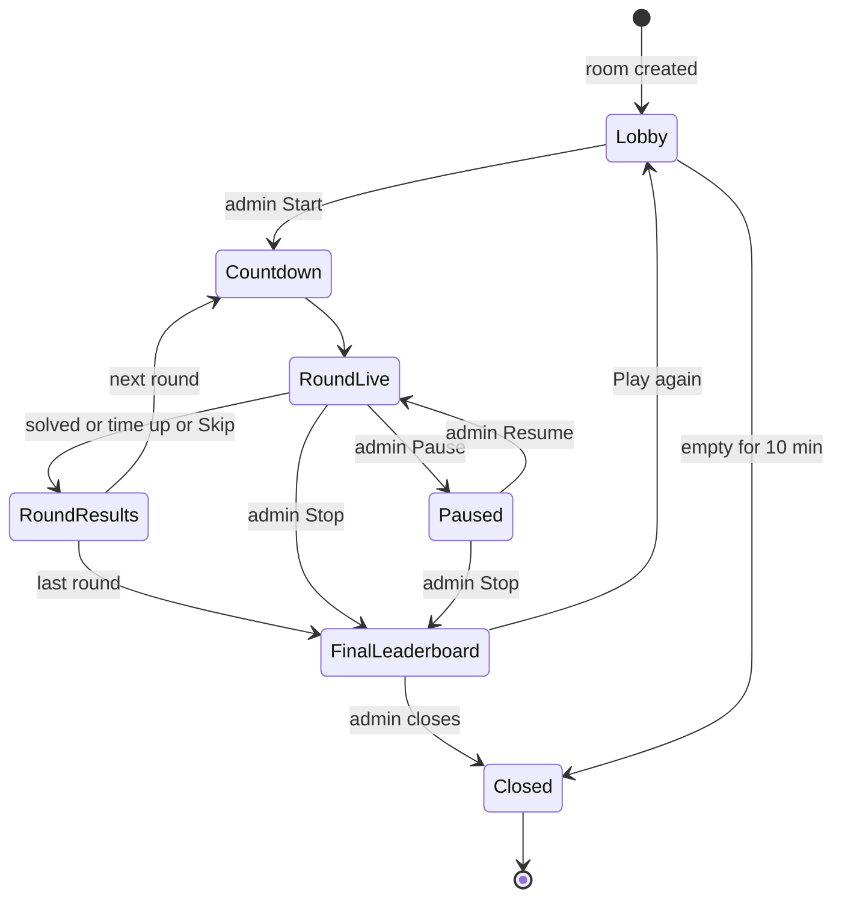
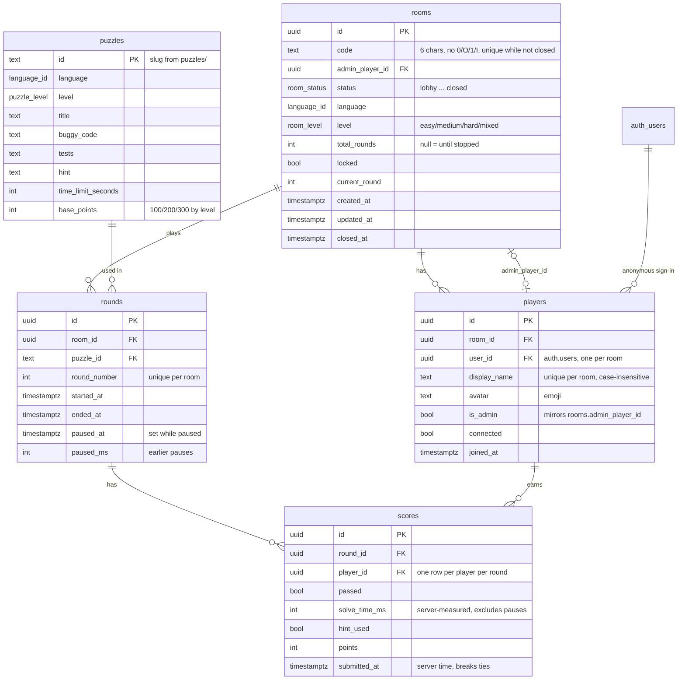

# Architecture

The full product plan (game modes, scoring, screens, test plan, failure cases)
is the TB-19 epic. This doc covers how the code is organised and the contracts
every task builds on. Update it when you change one of those contracts.

## Stack

| Part             | Choice                                                   |
| ---------------- | -------------------------------------------------------- |
| App              | Next.js (App Router), React, TypeScript (strict)         |
| Styling          | Tailwind CSS v4                                          |
| Editor           | Monaco                                                   |
| Database + live  | Supabase (Postgres + Realtime)                           |
| Code runner (v1) | In the browser: Web Worker for JS/TS, Pyodide for Python |
| Hosting          | Vercel (preview deploy per PR)                           |
| Tests            | Vitest (unit), Playwright (E2E)                          |
| Tooling          | pnpm, ESLint, Prettier, GitHub Actions                   |

## Folder map

```text
app/                  Routes (App Router). Pages stay thin: they compose components.
components/           Reusable UI components.
lib/runner/           Code-runner plug-in interface, language config, runners.
lib/game/             Pure game logic: scoring, room state machine, room codes.
lib/db/               Supabase client, generated types, typed data access.
puzzles/              Puzzle files (format defined in Phase 2).
supabase/             Local Supabase config, SQL migrations, dev seed, pgTAP tests.
scripts/              Repo scripts, e.g. the puzzle checker.
e2e/                  Playwright tests.
docs/                 This doc and other design notes.
```

Rules of thumb:

- `lib/game` is framework-free TypeScript (no React, no Supabase), so it is
  easy to unit test. UI and data access call into it, never the other way.
- Anything that talks to Supabase goes through `lib/db`; components do not
  build queries inline.
- Client components only where needed (editor, realtime, interaction).

## Code runner plug-in interface

Defined in `lib/runner/types.ts` (types) and `lib/runner/config.ts`
(language list, limits). Phase 2 adds the implementations.

```ts
type LanguageId = "javascript" | "typescript" | "python";

interface RunRequest {
  language: LanguageId;
  code: string; // player's code (or the reference fix)
  tests: string; // test source in the same language
  timeoutMs?: number; // default DEFAULT_RUN_TIMEOUT_MS = 5000
}

type RunStatus = "passed" | "failed" | "error" | "timeout";

interface RunResult {
  status: RunStatus;
  tests: { name: string; passed: boolean; message?: string }[];
  output: string; // console output, capped at MAX_OUTPUT_CHARS
  error?: string; // for "error" / "timeout"
  durationMs: number;
}

interface CodeRunner {
  readonly language: LanguageId;
  run(request: RunRequest): Promise<RunResult>; // never rejects
  dispose(): void;
}
```

Contract for implementations:

- Code runs off the main thread (Web Worker). The page must never freeze.
- The timeout is enforced from the outside: terminate the worker after
  `timeoutMs` and return `status: "timeout"`. Do not trust code to stop itself.
- No network, DOM or storage access from user code.
- Syntax errors and crashes return `status: "error"`; `run` never throws.
- Adding a language = add a `LanguageId`, a `LANGUAGES` entry, a runner, and
  puzzles. Nothing else should change.

Known trade-off (accepted): runs happen in the player's browser, so a
determined player could fake a pass with dev tools. Fine for an internal game.

## Room state machine

Copied from TB-19 §12. The room's current state lives in the database and is
broadcast over Supabase Realtime. Only the admin moves the room between states
(except time-based transitions).



The state ids in code (`RoomState` in `lib/game/types.ts`) are `lobby`,
`countdown`, `round_live`, `paused`, `round_results`, `final_leaderboard`,
`closed`. Every transition above gets a unit test when the machine is
implemented; any transition not listed is rejected.

## Data model

Defined by the SQL migrations in `supabase/migrations/` (run in filename
order). TypeScript types in `lib/db/types.ts` are generated from them with
`pnpm db:types`; CI fails if they drift.



Enums: `room_status` (same ids as `RoomState`), `language_id` (same as
`LanguageId`), `puzzle_level`, `room_level`. A type test keeps them in sync.

Notes:

- **No reference fix in the database.** It stays in `puzzles/` for the CI
  checker, so no API call can ever return it.
- **Room codes** are generated in Postgres (`private.generate_room_code`) and
  unique only among rooms that are not closed (partial unique index), so codes
  can be reused. `lib/game/room-code.ts` validates what players type.
- **Indexes:** open-room code lookup (`rooms_open_code_key`), players by room
  and name, scores by round + player and by player (leaderboard), rounds by
  room + number.

### Identity and row-level security

Players have no accounts. Each browser signs in with **Supabase anonymous
auth**, and `auth.uid()` identifies the player in every policy. A player row
links that user to one room, so rejoining from the same browser keeps the
name and score.

| Table / view       | Read                       | Write                                                     |
| ------------------ | -------------------------- | --------------------------------------------------------- |
| `rooms`            | Players in that room       | Admin only: `status`, settings, `locked`, `current_round` |
| `players`          | Players in that room       | Own `connected` flag only                                 |
| `puzzles`          | Anyone                     | Nobody (migrations / seed only)                           |
| `rounds`           | Players in that room       | Nobody yet (Phase 3 adds round functions)                 |
| `scores`           | Players in that room       | Nobody: only `record_score()`                             |
| `room_leaderboard` | Players in that room (RLS) | n/a (view, `security_invoker`)                            |

Everything else goes through `security definer` functions that check
`auth.uid()` themselves:

| Function                                                           | Who                  | Does                                                                                                 |
| ------------------------------------------------------------------ | -------------------- | ---------------------------------------------------------------------------------------------------- |
| `find_open_room(code)`                                             | Anyone               | Status, lock, full flag and settings of an open room. Nothing else.                                  |
| `create_room(language, level, display_name, avatar, total_rounds)` | Signed in            | New room in `lobby` with a fresh code; caller becomes admin.                                         |
| `join_room(code, display_name, avatar)`                            | Signed in            | Joins an open, unlocked, non-full room (max 50). "Riya" → "Riya (2)". Rejoin returns the old player. |
| `record_score(round_id, passed, hint_used)`                        | Players in the round | Server measures solve time and computes points. A pass is final.                                     |

Errors are raised with a stable code as the message (`room_not_found`,
`room_locked`, `room_full`, `round_not_live`, ...); `lib/db` turns them into a
typed `DbError`.

Scoring (TB-19 §3) lives in `private.calculate_points`: base points (Easy 100 /
Medium 200 / Hard 300) + up to 50% speed bonus for time left − 25% if a hint
was used; unsolved = 0. A 5 s grace after the deadline absorbs network lag.
The leaderboard ranks by total points, then total solve time; exact ties share
the place. Task 13 may tune the numbers in a new migration.

### Data access (`lib/db`)

Components never build queries inline. They call typed functions that take a
Supabase client:

```ts
const db = createBrowserDbClient();
await ensureSignedIn(db); // anonymous sign-in, reuses the stored session
const { room, player } = await createRoom(db, {
  language,
  level,
  totalRounds,
  displayName,
  avatar,
});
const preview = await findRoomByCode(db, "bug-7kx"); // null if unknown/closed
await joinRoom(db, { code, displayName, avatar });
await listPlayers(db, room.id);
await recordScore(db, { roundId, passed: true, hintUsed: false });
await getLeaderboard(db, room.id);
```

### Working on the database

```bash
pnpm db:start   # local Supabase in Docker (API on :54321, Postgres on :54322)
pnpm db:reset   # recreate from migrations + supabase/seed.sql
pnpm db:test    # pgTAP tests in supabase/tests (RLS, codes, names, scoring)
pnpm db:types   # regenerate lib/db/types.ts after changing a migration
```

Add a change as a **new** migration file; never edit one that has been
applied to production. Supabase grants new tables to the API roles by
default, so every new table needs `enable row level security`, explicit
grants, and a pgTAP test.

## Environment

Only public values (`NEXT_PUBLIC_SUPABASE_URL`, `NEXT_PUBLIC_SUPABASE_ANON_KEY`)
are used by the app; see `.env.example`. Supabase now calls the anon key the
**publishable key** (`sb_publishable_…`); the variable name stays the same.
Data is protected by Supabase row-level security, not by hiding the key.
Service-role keys never go in this repo or in client code.

The Supabase project must have **anonymous sign-ins** enabled
(Authentication → Sign In / Providers). Locally, `supabase/config.toml`
enables them.
